# Conky Studio

<div align="center">

  

## **Design Conky HUDs visually. Ship real themes.**

**2 nodes = 1 widget in 30 seconds.**

* No Lua editing  
* No restart loops  
* No fake previews
* Advanced options for power users
* Build simple, or build something complex

Design visually → export real Conky themes.

Start simple. Scale to anything.

</div>

<p align="center">
  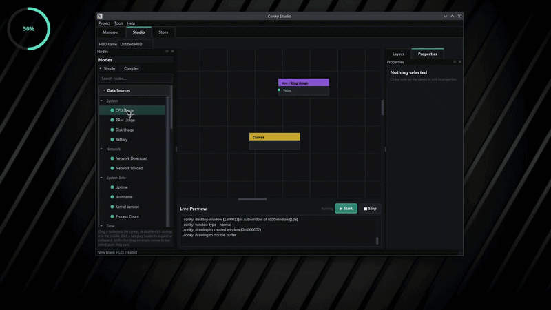
</p>

<div align="center">

**No mockups. No fake canvas. No runtime lock-in.**

Build desktop HUDs visually with a node-based workflow, then export standard Conky themes that run without Conky Studio.

[](https://www.youtube.com/watch?v=ys-cg211jsE)
[](https://discord.gg/kJZCZWg5nw)
[](https://www.youtube.com/@BobbyComet)
[](https://github.com/bobbycomet/Conky-Studio/wiki)
[](https://github.com/bobbycomet/Conky-Studio/releases/download/v1.0.7.1/Conky-Studio-1.0.7.1x86_64.AppImage)
[](https://github.com/bobbycomet/Conky-Studio/wiki/Conky-Studio-History)
</div>

---

## Why this exists

Conky is extremely powerful, but creating advanced HUDs traditionally means:
| Traditional workflow | Conky Studio |
| -------------------------------------------- | --------------------------------------- |
| Edit Lua → restart → repeat | Change properties and preview instantly |
| Manually position `${goto}` and drawing code | Arrange elements visually |
| Connect scripts by hand | Use sources as nodes |
| Risk breaking existing themes | Import, edit, and rebuild safely |

The goal is simple:

> Make Conky as easy to design as it is powerful to run.

---
## Create your first widget in 30 seconds

1. Drop a **CPU** source
2. Drop a **gauge**, **bar**, or **text** node
3. Connect them
4. Enable live preview

That is a real Conky widget, not a mockup.

[](https://www.youtube.com/watch?v=BhB6O_jakxo)

From there, build complete HUDs with:

* logic chains
* gradients
* custom scripts
* click actions
* Custom Lua/Cairo rendering
* 98 built-in nodes — 43 sources, 20 logic, and 35 visuals. Install the optional 56-node plugin pack (12 logic, 37 visual) for 149 total nodes.
* Check [](https://github.com/bobbycomet/Conky-Studio/wiki/Requirements) and [](https://github.com/bobbycomet/Conky-Studio/wiki/Compatibility) to get started

## Features

* **Visual node editor** — sources → logic → visuals
* **Node properties** — Resize visuals, add gradients, create CRT effects, control animation speed, move visuals, edit values, and much more.
* **Live preview** — runs a real Conky process
* **Theme manager** — manage themes in `~/.config/conky`
* **Theme wizard** — generate starter HUDs by style
* **Legacy importer (beta)** — convert existing themes into editable projects
* **Plugins** — community JSON node extensions
* **Smart system detection** — X11/Wayland, compositor, Conky build, sensors, GPU/network hints
* **Clean exports** — standard Conky theme folders
* **Custom Lua support** — full Cairo escape hatch when nodes are not enough
* **Theme preview** — on the theme manager, you will be able to see the theme via preview.png if there is one in the folder

Combine with the [](https://github.com/bobbycomet/GriffinUpdater) for auto-updates, or force an update without going to GitHub or OpenDesktop.

---

### Screenshots

| Studio | Live Preview | Theme Manager | Starter Theme |
|:------:|:------------:|:-------------:|:-------------:|
| 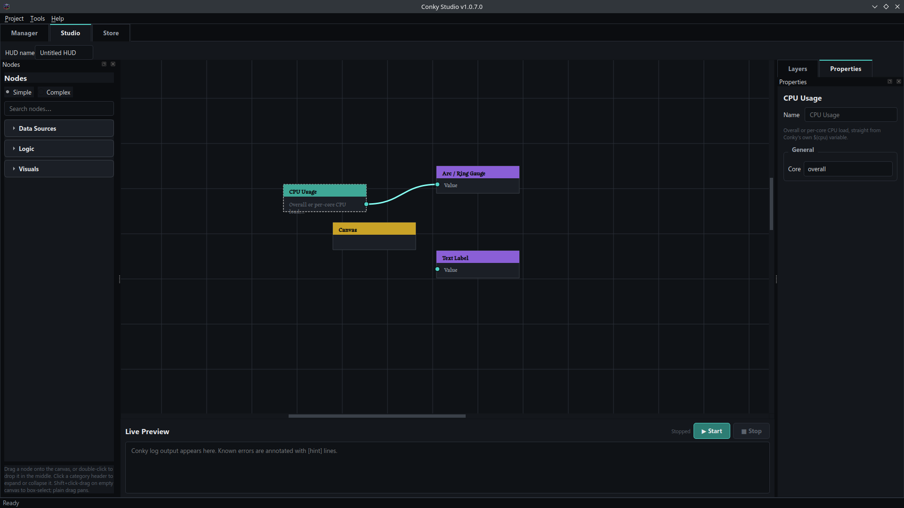 | 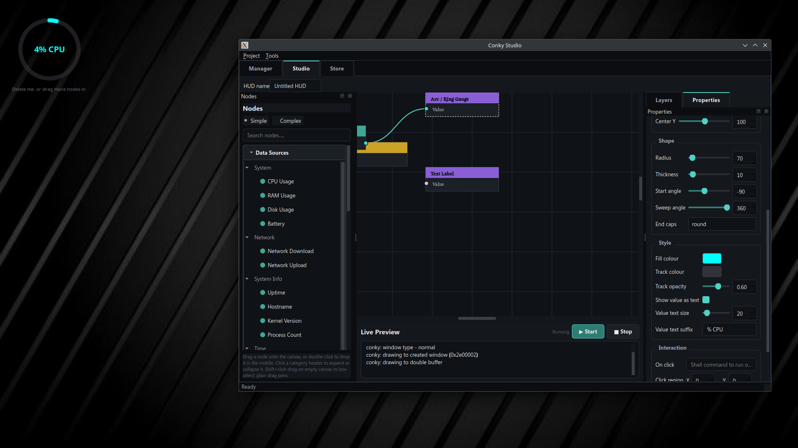 | 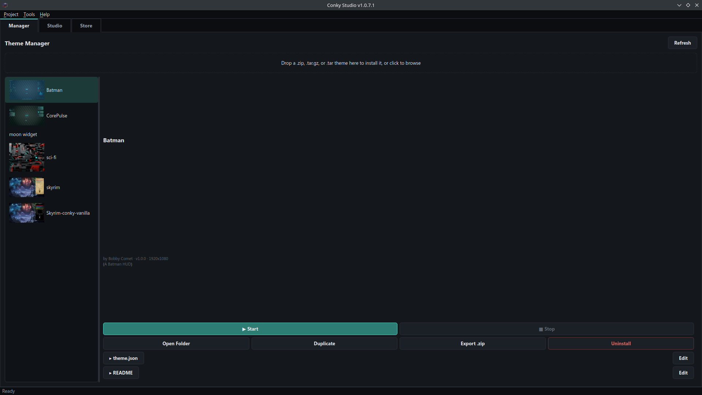 | 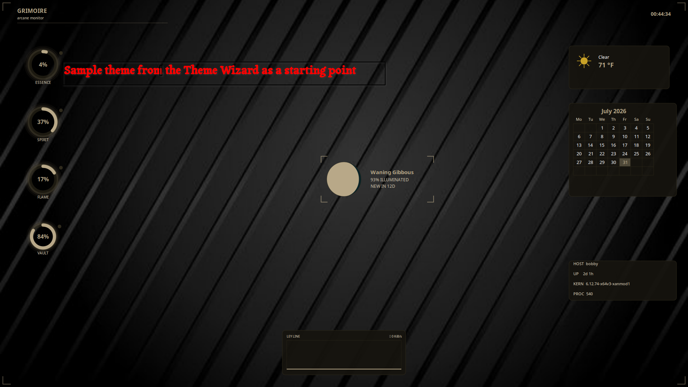 |

| Gamer Theme | Colour | Speed | Undocking |
|:-----------:|:------:|:-----:|:---------:|
| 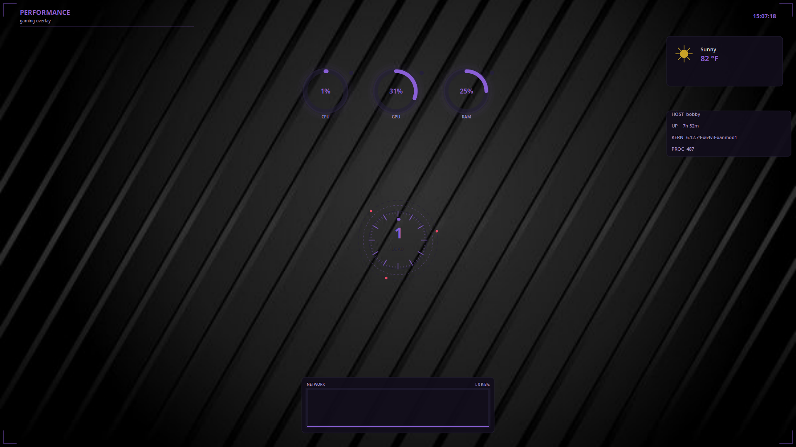 | 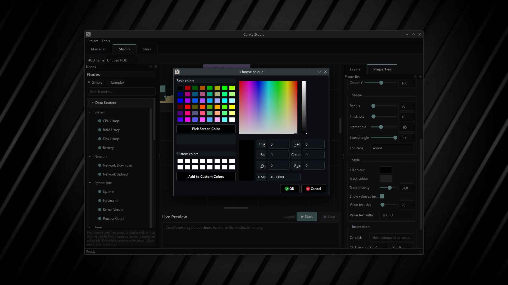 | 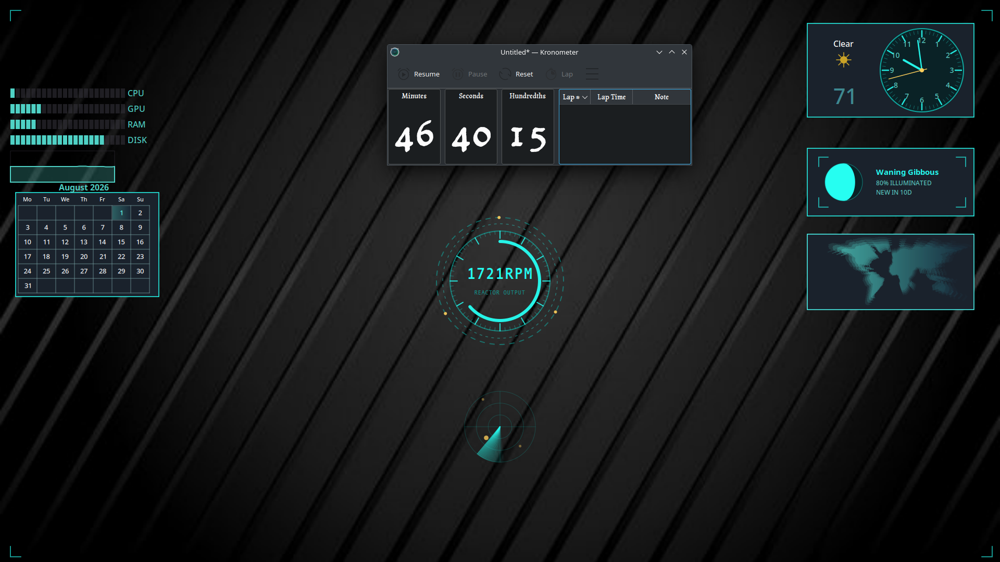 | 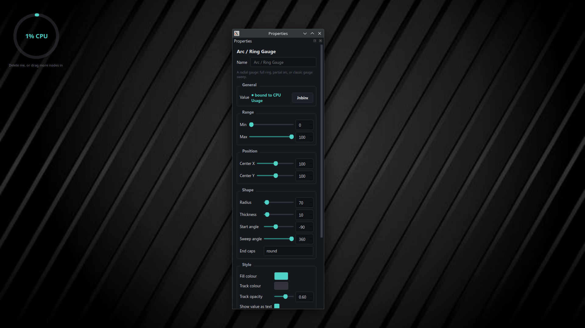 |

### Current Official Compatible Themes  
*click an image, download the zip, drop in manager*

| Skyrim Vanilla | Skyrim Parchment | CorePulse | Batman |
|:--------------:|:----------------:|:---------:|:------:|
| <a href="https://www.opendesktop.org/p/2287070/"></a> | <a href="https://www.opendesktop.org/p/2366029/"></a> | <a href="https://www.opendesktop.org/p/2367501/">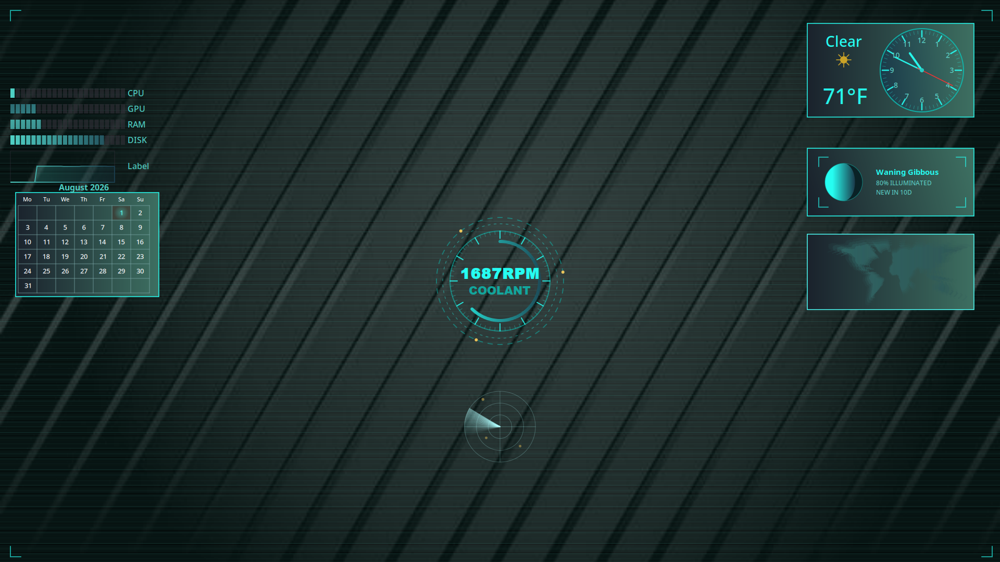</a> | <a href="https://www.opendesktop.org/p/2366693/">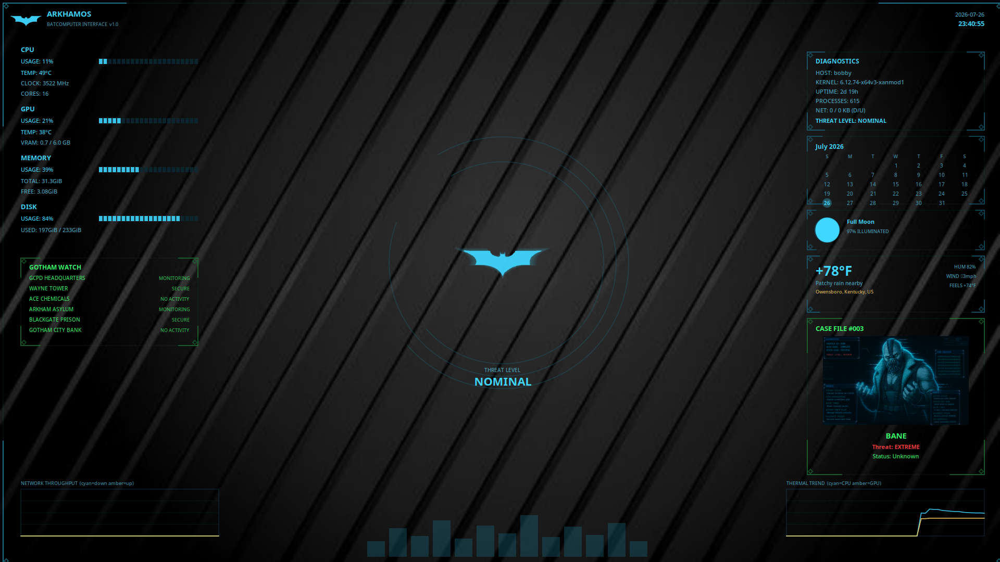</a> |

---

## What makes this different

Conky Studio is a **visual authoring tool for Conky**, not a replacement runtime.
Your designs are converted into normal Conky files:

* `conky.conf`
* `render.lua`
* `start.sh`
* custom scripts
* assets and resources

Exported themes run independently using Conky's normal pipeline.

**Live preview = export.**

The preview uses the same build path as the final theme, meaning what you see is what you ship.

---

## Theme Compatibility
Conky Studio's Manager is flexible enough to run and manage any Conky theme that provides a standard `start.sh` entry script.

This includes:

* Themes created with Conky Studio
* Manually built Conky themes
* Compatible third-party themes
* Auto-generates a `start.sh` for themes without one: 1.0.7+ feature

Conky Studio does not need to build a theme in order to manage it. If a theme has its own folder and a working `start.sh`, it can be launched, stopped, and organized through the Manager. This is different from the legacy importer, as the importer is trying to make it usable and editable within the Studio and its nodes.

You can also run themes manually:
```
cd ~/.config/conky/<theme-folder>
./start.sh
```

Conky Studio acts as the manager and launcher after a theme is built; it does not need to remain open while themes are running.
See [](https://github.com/bobbycomet/Conky-Studio/wiki/Theme-Compatibility) for an example of the start.sh

---

## Runtime Performance
Conky Studio is an authoring tool, not a runtime interpreter.
The node graph is converted into normal Conky files during build. The exported theme runs independently of Studio.
Node count does not directly determine runtime performance. Performance depends on the generated Lua logic, update intervals, and normal Conky execution.

---

## Built for Conky, not a replacement or fork

Conky Studio is an independent project designed to generate and manage HUDs for [](https://github.com/brndnmtthws/conky).
Conky is a free software project developed by the Conky maintainers and contributors. Conky Studio is an independent third-party tool that uses Conky as its output target.

It is not affiliated with, endorsed by, or sponsored by the official Conky project or its maintainers.
Conky is licensed under the GPL-3.0 License.

> **IMPORTANT:** If you encounter a bug with Conky Studio, please do **not** report it to the Conky developers or maintainers.
>
> The Conky team only handles issues related to the Conky project itself. Conky Studio is a separate application that generates standard Conky configuration files, Lua scripts, and related assets.
>
> Conky Studio issues should be reported to the Conky Studio project. In rare cases, Conky Studio may be affected by an upstream Conky bug, but Conky Studio does not modify or introduce bugs into the Conky codebase.
>
> If an exported theme fails when run outside Conky Studio, first verify whether the issue is with the generated files or with Conky itself. To test this, open a terminal in the exported theme directory (where `start.sh` is located) and run:
>
> ```
> ./start.sh
> ```
>
> Running the exported theme directly will provide diagnostic output that can help identify whether the problem comes from the generated files or from Conky itself.

---

## Continue exploring

The sections below cover on the wiki:

* Sharing projects
* Compatibility
* Architecture
* Nodes
* Legacy Import details
* Requirements
* Starter themes
* Built examples

For the full technical documentation, see the [](https://github.com/bobbycomet/Conky-Studio/wiki).

---

# 1.1.0 Roadmap

The 1.1.0 release focuses on expanding the Conky Studio ecosystem.

* **Node Vault** — community plugin distribution for extending Conky Studio with new sources, logic, and canvas nodes
* **HUD Vault** — community theme sharing platform for discovering and installing complete Conky HUDs
* **Source plugins** — allow new data providers without modifying the core application
* **Canvas plugins** — allow new visual components and rendering systems
* **Native multi-monitor support** — support building HUD layouts across multiple displays. This will be a core Studio feature, not a plugin, because it changes how projects are built and exported. Existing projects remain compatible through automatic migration from the current single-canvas format to the new window-based format.
